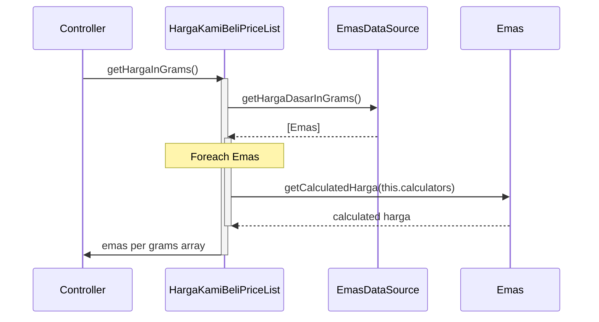

```mermaid
sequenceDiagram
    Controller->>HargaKamiBeliPriceList: getHargaInGrams()
    activate HargaKamiBeliPriceList
    HargaKamiBeliPriceList->>EmasDataSource: getHargaDasarInGrams()
    EmasDataSource-->>HargaKamiBeliPriceList: [Emas]
    activate HargaKamiBeliPriceList
    Note over HargaKamiBeliPriceList: Foreach Emas
    HargaKamiBeliPriceList->>Emas: getCalculatedHarga(this.calculators)
    Emas-->>HargaKamiBeliPriceList: calculated harga
    deactivate HargaKamiBeliPriceList
    HargaKamiBeliPriceList->>Controller: emas per grams array
    deactivate HargaKamiBeliPriceList
```